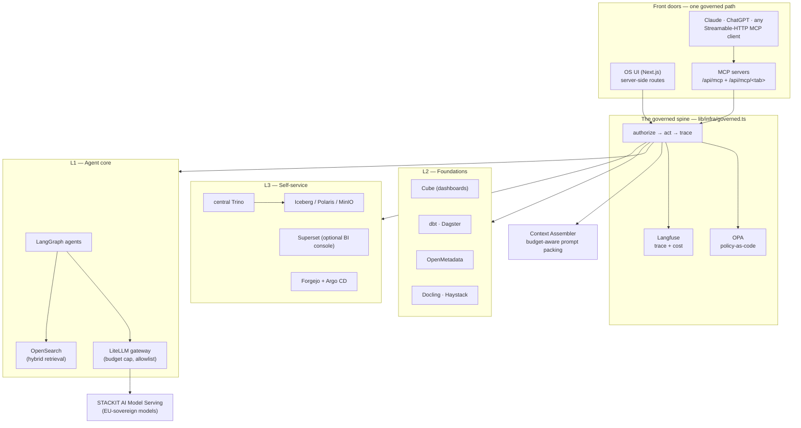

<!--
  SPDX-License-Identifier: Apache-2.0
  Copyright 2026 Borek Data Ventures UG (haftungsbeschränkt)

  SINGLE SOURCE for the Sovereign Agentic OS guide.
  Edit this file when the OS changes, then run scripts/build-docs.sh to refresh the PDF.
  {{DATE}} and {{GIT_COMMIT}} are substituted at build time from `git log -1`
  (see scripts/build-docs.sh and docs/README.md). The committed .md keeps the placeholders.
  The PDF design (cover, fonts, layout) lives in docs/assets/guide.css.
-->

\newpage

# The one-paragraph version

The **Sovereign Agentic OS** is a self-hostable, EU-residency operating system for your
data, knowledge, agents and software — a single **governed** stack where every action, taken
by a person *or* by an AI, runs **as you**: OPA-policy-checked, row- and column-secured, and
Langfuse-audited. It assembles roughly two dozen best-in-class, permissively-licensed
open-source tools — a Trino/Iceberg lakehouse, a Cube semantic layer, OpenSearch retrieval,
a LiteLLM model gateway to sovereign EU models, LangGraph agents — into one operating model
you learn once and apply everywhere. Its promise is simple and, we think, important: it gives
AI **real, safe hands on your data**. The web UI and the AI (over MCP) travel the *exact same
governed path* — there is no privileged back door — so you can hand an agent the keys to your
lakehouse and know, provably, that it can never do anything you couldn't do yourself.

> **Where to go next.** Curious what it feels like? Read *The guided tour*. Want to run it?
> Jump to *Quickstart*. Coming from a governance or security background? Start with *The
> governance model*. Contributing code? *How to contribute* and `os-ui/ARCHITECTURE.md` are
> your on-ramp.

\newpage

# Why this exists

For two years the industry has been stuck on the same tension. **Agents are only useful when
they can act** — read the warehouse, write a table, ship an app, call a tool. But the moment
an agent can act, the honest questions arrive: *Whose identity is it running as? What is it
allowed to touch? Where did the data go? Can I prove, after the fact, exactly what it did?*
Most stacks answer these by wrapping an autonomous agent in ad-hoc guardrails bolted on after
the fact — and by shipping your prompts and data to a US-hosted model.

The Sovereign Agentic OS answers them structurally, with three ideas doing all the work:

1. **One governed path for humans and AI.** Every write — from a button click, from a tab's
   built-in assistant, from Claude or ChatGPT over MCP, or from an autonomous agent — flows
   through the *same* function: `authorize → act → trace`. Governance isn't a feature you can
   forget to turn on; it's the only road in.

2. **Sovereignty is the substrate, not a badge.** The production target is **STACKIT**
   Kubernetes with STACKIT Object Storage in **EU01 / Deutschland Süd**, and model calls
   route to **STACKIT AI Model Serving**, so prompts and completions never leave the EU
   boundary. Default-deny egress means an agent has *no* raw internet unless you grant it.

3. **Permissive open source, end to end.** Every bundled component is Apache-2.0 / MIT / BSD /
   ISC-class licensed — full auditability, no proprietary lock-in, the right to host and modify
   it forever. The core is **Apache-2.0**, and the permissive posture is *enforced*, not merely
   promised: an automated **`check:licenses`** gate (`license-checker --onlyAllow`) rejects any
   dependency outside a strictly permissive allowlist (MIT, Apache-2.0, ISC, BSD-2/3-Clause,
   0BSD, and a few equivalents) — so no copyleft can slip in — with a CycloneDX SBOM
   (`sbom.cdx.json`) and a full attribution manifest (`THIRD-PARTY-LICENSES.md`) alongside.

## Who it's for

- **Regulated organizations, the public sector, and EU enterprises** that need data residency,
  a complete audit trail, and zero dependency on US-controlled cloud or hosted LLMs — but
  still want production-grade agentic workflows.
- **Data and platform leaders** who want *one* place for the lakehouse, the semantic layer, the
  knowledge spine, BI, and software delivery — instead of a dozen disconnected tools and a
  governance story stitched across all of them.
- **Curious engineers and OSS contributors** who want to see how a governed agent runtime is
  actually built — and to extend it, one clean tab-module at a time.
- **Data Masterclass participants** building real agentic systems on the *same* production
  components used in the field, not a teaching fork.

## The problems it solves

| The tension | How the OS resolves it |
|---|---|
| **Governance vs. agent autonomy** | Agents are genuinely autonomous *inside* a policy envelope. Every tool call is OPA-authorized; anything out of scope doesn't fail silently — it queues to a human as an approval card. |
| **Sovereignty vs. capability** | The full stack runs in your EU region on open source. Models are sovereign (STACKIT) yet swappable; nothing phones home. |
| **Ten tools vs. one source of truth** | One lakehouse, one semantic layer, one knowledge spine, one identity, one audit — so BI, agents and dashboards can never disagree about "revenue." |
| **Demos vs. production** | The same Helm chart runs on a laptop (`kind`) and on a sovereign STACKIT cluster. The only difference is a values choice per backend. |

\newpage

# The operating model — learn it once

One idea ties every screen together. Internalize it here and the whole product reads the same.

## Everything is a governed artifact

Whatever you make — a dataset, a knowledge workflow, a file, an agent, an app, an ML model, a
metric, a connection, a dashboard — is an **artifact** with the same four attributes:
**owner · domain · type · visibility**. Whatever its type, it travels one lifecycle:

> **Create → Document → Use → Promote** — authored in the UI (which scaffolds the *real* tool
> underneath: a dbt model, a metric's semantic declaration, a Forgejo repo, a KServe
> service), preview-first,
> cataloged and audited.

## One artifact model — every build tab reads the same

Every artifact in the OS reads the same way: a tab lists tiles in folders; **＋ New** opens a
short **type chooser** and lands you in **Edit**; clicking a tile opens a full-page **View**; a
**✎ Edit** button re-opens it. Learn one tab and you can drive them all, because they share the
same shape:

- **＋ New → type → Edit → View.** The Context tabs (Data, Metrics, Files, Knowledge,
  Connections) and Dashboards all speak this one language — no staged steppers. Edit is a set of
  **named sections, each with its own Save** (e.g. Data's *Ingestion · Documentation ·
  Transformation · Checks*), so you save the part you changed and nothing else. **View** is the
  read-first surface (talk to it, preview it, read its stats and quality). The build tabs that
  produce *running systems* — **Agents** (Define · Design · Build · Run · Evaluate), **Software**
  (Define App · Design Epics · Choose Context · Build App · Test & Publish) and **Science**
  (Design · Launch · Monitor) — keep a
  **staged builder** (`lib/core/stages.ts` + `components/core/StageShell.tsx`),
  because a deploy genuinely has ordered gates; the artifact tabs no longer do.
- **Honest state.** Nothing shows a ✓ it hasn't earned: a data-quality scorecard turns green only
  when checks actually ran and passed (honestly `unknown`, never a fake pass, when nothing ran), a
  metric previews the real governed query, and a dashboard panel shows a live / offline-mock badge
  for whether Cube answered. No faked green.
- **AI where the work happens.** The Sovereign-OS AI helper is scoped to what you're doing and
  acts through the same governed tools. On the Data tab it dissolves into the flow — each section
  carries big **✨ actions** ("✨ Draft documentation", "✨ Clean it up", "✨ Suggest measures" …) —
  the same governed, audited, cost-capped assistant underneath, surfaced exactly where the work
  happens.
- **Simple ⇄ Developer, and lifecycle-in-header.** A **Simple** view keeps the flow calm and
  NL-first; a **Developer** view exposes the raw technical surface (the dbt SQL, the Cube YAML,
  the lineage graph, the repo tree). The artifact's name, visibility badge and lifecycle controls
  (Archive · Restore · Delete · Promote) live in a **persistent header**, always reachable — this
  is where a dataset, metric or dashboard is **shared**, not a separate stage.

## The sharing ladder

Visibility widens **one rung at a time**, and each move is strictly **two-step** — the person
who *triggers* a promotion is never the person who *approves* it:

The OS speaks **one scope vocabulary everywhere — My · Domain · Company** (defined once in
core, `lib/core/scopes.ts`). "My" is your private draft space; "Domain" is your team; "Company"
is the whole tenant. Promote reads **"Promote to Domain"** and certify **"…to Company"** — the
same two verbs on every tab.

**Your "My" work is yours — no approval, ever.** A builder — *and the agents they build* —
create and write their own **personal** artifacts of every type (data, files, knowledge,
metrics, connections, software, dashboards, agents, science) **directly**, with no admin
review. The person's own rights and ownership are the authority. Approval only appears the
moment you widen the audience:

| Scope | Meaning | Who triggers | Who approves |
|---|---|---|---|
| **My** | you only — the default; **full rights, no approval** | — | — |
| **Domain** | usable across the owning domain | the **owner** files a promotion request | a **domain admin** of that domain |
| **Company** *(certified)* | discoverable and importable by *other* domains, listed in the Marketplace storefront | a **Builder / Domain admin** — the domain vouches for it | the **tenant Administrator** — the platform accepts it |

**You can only change what you originally built.** Edit rights follow ownership, not tier —
even a shared artifact is editable only by its original owner (and, for Domain/Company
artifacts, an in-scope admin); a personal "My" artifact is strictly owner-only, invisible to
admins.

**Approving *is* the action.** High-stakes actions never fail silently: when you promote,
certify or request a deploy you get one calm confirmation — *"Request filed — awaiting approval
to Domain/Company"* — with a **Go to Policies & Approvals →** button that deep-links to and
highlights the exact request. An admin who *can* approve it sees an **Approve now** button that
approves inline (fail-closed — non-approvers never see it, and the server re-checks). On
approve, the platform executes the governed effect — for a dataset, a physical publish; the
tier flips only once it verifies — and writes the audit. Nothing enters the governed store
without **documentation + passing checks**: a transparency gate that turns green only when an
artifact is documented and in the lineage graph.

**The ladder also runs down — on every artifact type.** From an artifact's header, **Unshare**
returns a Domain artifact to My (its owner or an in-domain Domain admin) and **Revoke from
Company** returns a certified one to Domain (Admin). A metric shares its dataset's tier, so
demoting a metric moves the dataset and every metric on it together — the confirm dialog says so.

## Four roles, assigned per domain

The ladder is exactly **creator < builder < domain_admin < admin**.

| Role | What they do |
|---|---|
| **Creator** | the base role — creates and runs their **own** artifacts (My scope by default) and consumes anything at Domain or Company scope. Files promotion requests; cannot approve. |
| **Builder** | the domain **approver** — everything a Creator can, plus review/approve My→Domain promotions, deploys, knowledge and connections. An approver, *not* a people-admin. |
| **Domain admin** | everything a Builder can, plus administering the users of their **own domain(s) only** — invite, edit, assign roles **up to Builder**. Never mints another Domain admin. |
| **Administrator** | tenant-wide — the only role that appoints **Domain admins**; sets policy, certifies to Company scope (the Marketplace storefront), sets cost caps; runs the Admin section. |

Roles are assigned **per domain** and **compiled to OPA**, so a person who is a Builder in one
domain and a Creator in another sees exactly the right controls in every tab, instantly.

## Every assistant acts, and acts as *you*

Each tab has a built-in assistant, and there is one **overarching assistant** — **Ask the OS**
— present on every tab. Neither is a chat box. Each runs one loop: **PLAN** with the reasoning
model, then **ACT** in a bounded tool-calling loop with the worker model — calling that tab's
governed tools, which are the *same* OPA-authorized, Langfuse-traced functions the UI uses.
Crucially, **Ask the OS is a client of the OS's own MCP server**: it dispatches through the
exact same governed path (`handleRpc`) that Claude Desktop uses, under *your* delegated
identity. It inherits identical guardrails — role floor, approval gates, OPA/RLS, audit — and
it is transparent: each answer lists the governed tools it invoked, and if governance *blocks*
a call it says so plainly. There is **no privileged side-channel**.

\newpage

# The guided tour

Open the OS in a browser and you land on a left sidebar organized into named sections. Here is
the whole map, in sidebar order — each surface in a few vivid sentences, with what you *do*
there.

## Entry

- **Home — the golden-path launcher.** The warm front door after you pick a domain. An
  illustrated launcher of the golden paths (Data, Knowledge, Agents, Software, Science,
  Metrics, Dashboards, Big Bets, Marketplace, Connections), each card with a role-aware
  action. It *only* orients and routes — the live view lives one click away in Cockpit.
- **Cockpit — what's moving, what needs you.** A persona-ordered live overview: a pulse strip
  (*Needs you · In progress · Your items · Spend* vs. cap), your work-in-progress, and a
  scannable "top items, by type" board. Cockpit *reads and routes* — it never recomputes
  another tab's numbers and never bypasses governance.
- **Marketplace — consume across domains.** The *Consume* counterpart to every tab's *certify to
  Company* step: discover and reuse Administrator-certified (Company-scope) products of every
  type across the tenant. The storefront keeps its name; importing is a **governed grant**, not a
  copy — the default is read-in-place, under your own identity and row-level security.

## Plan

- **Strategy — pillars, value and adoption.** Where the company plans its agentic
  transformation, in exactly three calm sections: **Strategic Pillars** (each with a big value
  target; Big Bets are created under them), **Self Service** (how broadly your people build for
  themselves), and **Foundations** (the certified asset base every bet builds on).
- **Big Bets — initiative roadmaps.** A strategic AI bet as a **goal + dated roadmap** built
  from real artifacts across the platform. **Every bet sits under a Strategic Pillar** — creation
  requires one from both entry points (the Big Bets "New" panel and "New bet under this pillar"
  from Strategy) and via MCP. Status derives *live* from each artifact's real lifecycle; the
  roadmap rolls up on-track / at-risk.
- **Operating Model — how the company runs, at three scopes.** *My / Domain / Company Operating
  Model*, each a fixed set of sections — **General · Strategy · Business · Organization ·
  Architecture · Data · Glossary** — governed per scope (My = owner, Domain = domain_admin+,
  Company = admin). It's the durable, structured backbone agents can be granted as context.
- **Workflows — the process spine.** A **workflow** per business process (ordered steps ·
  business rules · expert knowledge, each step owned by a Human / Software / Agent / external
  actor), retrievable and grantable to agents — with a **Data & Metrics** tab that links the
  governed datasets and KPIs the process runs on, each a scope-badged chip deep-linking to the
  real artifact.
- **MCP** *(Builder+)* — the setup surface for connecting external AI clients over MCP.
- **Tutorials.** An illustrated, hands-on tutorial for every tab — fourteen today, each kept
  in step with its tab's current journey — reached from Home or a tab header, that can
  spotlight the real controls and let you practice in a sandbox before doing it for real.

## Context

- **Knowledge — the domain's captured know-how.** Human-authored reference knowledge, made
  retrievable by a knowledge agent behind document-level security. Mark a decision rule **hard**
  and it compiles into an OPA guardrail. (The structured backbone — Operating Model, Strategy,
  Big Bets, Workflows — lives in the Plan section; Knowledge is the reference library.)
- **Files — a calm governed drive.** Any unstructured file — documents, images, audio, video —
  added via **＋ New** (**Upload a file** or **New note (markdown)** written in place) and
  auto-indexed (parse → embed → hybrid OpenSearch) so agents can search and cite it. Opening a
  file lands on a **full-page reading surface**. Governed exactly like Data; *"Use as"* distils a
  file into Knowledge or Data.
- **Data — datasets, refined and governed.** One artifact per dataset, two surfaces — **Edit**
  and **View** — that turn a plain-language flow into real governed artifacts (a dlt pipeline,
  dbt models, a Cube cube) with no YAML. **＋ New** opens a calm chooser first:
  **📥 Ingest new data** (bring a *file* in — external lakehouse data arrives governed, via a
  connection, not by ingest) or **🔗 Create a curated dataset** (combine
  governed datasets you can read into one new joined table). A **domain admin** sees a third card,
  **🔗 From a connection**, whenever a platform admin has exposed a warehouse or operational table
  to their domain: pick the exposed table, add a short description, and it adopts as a curated
  **Domain-tier** dataset (live or sync — see *Lakehouse — bringing external tables in*), with no
  bronze or refinement stage. Either lands you in **Edit**; a name
  already taken in the domain isn't a dead end — an inline note explains the clash and offers a
  one-click **Open** of the existing dataset, or a distinguishing name — and renaming later is a
  labelled **✎ Rename** button (the physical table slug stays stable). Tiles group into
  **Ingested Data** and **Curated Data**. **Edit** is a set of named sections, each with its own
  Save — no stepper, no Continue:
  an **ingested** dataset walks **Ingestion → Documentation → Transformation → Checks**
  (*Save Data · Save Documentation · Save Transformations · Save Data Quality Checks*); a
  **curated** dataset opens on **Composition** (pick an explicit **base dataset**, add **joins**,
  keep or rename columns, add **derived fields**, then *Save Composition*) followed by
  Documentation and Checks. Ingested data **never joins** — that is the curated path. A curated
  dataset can be composed from your OWN personal (My-tier) datasets, not only governed
  assets/products — any dataset built to Silver/Gold that you can read is a valid join partner, so
  you can build a curated view entirely from your own private data (its personal lane is read as
  you). The
  business (Gold) layer that metrics read is **materialized automatically**: a clean single-table
  ingested dataset **passes through** to a queryable business table with no manual "build Gold"
  step, and a curated dataset materializes the composition you saved. Measures are defined in the
  Metrics tab, not in the composition, so the business layer stays a pure projection/join and a
  rebuild never wipes them. The **Composition** join picker offers only datasets visible in your
  *active* domain (My / Domain / Company of the operating domain, with the Marketplace as the only
  cross-domain surface); its **"Keep columns" starts with every column kept** — remove the ones
  you don't want, or *Remove all* and hand-pick. AI is built into each section as big
  **✨ actions** — "✨ Draft documentation", the structured "✨ Clean it up" that fills the guided
  cleaning controls for your review (the AI never builds on its own), "✨ Explain this error"
  beside a real ingest error, "✨ Propose a clean/join", "✨ Suggest quality rules". The **Checks**
  section is a real data-quality gate: author dropdown-driven rule checks
  (`not_null`, `not_blank`, `unique`, `accepted_values`, `range`) that compile to SQL and run
  *for real* against the built table, yielding a **quality scorecard** — a 0–100 pass-rate and a
  passing/failing badge (honestly `unknown`, never a fake pass, when nothing ran) — let the OS
  **suggest rules from the column profile**, and watch three heuristic **monitors** — freshness,
  row-volume and schema stability — that learn each dataset's normal band from its own run
  history. Opening a tile lands on the full-page **View**: **Talk to Data** (governed NL→SQL, one
  validated read-only `SELECT`, executed under your row filters) → a **preview** with a
  raw · cleaned · business layer toggle (business by default) → **statistics** → the **quality
  scorecard** → **configuration**. Until it is shared the header carries a **"not certified"**
  chip, and sharing (Promote · Certify) lives in that header, not a stage. A **Developer** view
  exposes the raw dbt SQL, the physical table and the **lineage** graph behind the guided flow.
  A table imported from an external warehouse doesn't go stale either: a **"Keep this in
  sync"** panel schedules regular refreshes — **Full refresh**, **Add new rows** (incremental
  append over a cursor column, with a late-data lookback window), or **Update by key** (a
  merge) — Hourly / Daily / Weekly or your own cron. Every run executes **as the dataset's
  owner** through the same governed Trino path as the original import, with the cursor
  predicate pushed down to the source — no data ever flows through the app — and each slice
  lands in Iceberg carrying `_loaded_at` / `_batch_id` lineage columns. The dataset shows its
  **sync history and watermark**; ten consecutive failures **auto-pause** the schedule (with a
  one-click *Reset & full re-sync* recovery), and freshness in **Monitoring** reflects the
  last sync. Scheduled sync is built for *incremental slices*, not bulk backfills: the current
  per-run limits (statement timeout, single-node Trino sizing, object-storage capacity), the
  honest estimates behind them, and the concrete scale-up playbook — exact Helm values, backfill
  windowing, and when to switch to staged-file loads — are documented in
  [`docs/data-sync-scaling.md`](data-sync-scaling.md).
- **Connections — governed bridges to outside systems.** A Connection is `credentials +
  endpoint + a set of governed tools`, never a raw pipe — used to bring data in and to expose
  external APIs/MCPs as tools. You grant **use**, never the token; **reads are automatic, writes
  are approval-gated** (destructive ops blocked), and secrets are write-only. The Supported
  Connectors gallery is **grouped by vendor stack** (Microsoft · Google · AWS · Databricks ·
  Snowflake · Salesforce · Kajabi · Atlassian · Open source · Other) and searchable. When nothing in the
  gallery fits, a **Custom Connector** lets you add your own **REST/GraphQL API** or **MCP
  server** in one governed action: you name it, give the base URL and a write-only credential,
  and the OS **atomically files the egress-allowlist request** for that host — reads auto-allow,
  writes stay off until you enable them per-tool, and the far-side host cannot be reached until an
  Administrator approves the egress. The real catalogue now spans:
  **operational databases** (PostgreSQL · MySQL · SQL Server · MongoDB, federated through central
  Trino); **code & DevOps** (GitHub); **docs & knowledge** (Notion, Atlassian); a Supabase
  connector; **messaging & calendar** (Slack · Gmail · Google Calendar · Outlook · Teams —
  sending a message or email is always approval-gated, never automatic); **cloud governance /
  ML** (Microsoft Entra · Purview · Azure AI Foundry · AWS SageMaker, read-only); plus the
  established data-ingest (Google Drive / OneDrive), orchestration (Airflow) and catalog
  (**OpenMetadata**, read/discover of a customer's existing catalog, DLS-clamped to the tables
  the caller may already see — and now **active-only**: when you archive an OS dataset the
  integration best-effort **soft-deletes** its OpenMetadata entity, and unarchiving restores it,
  so the catalog reflects what's live rather than accumulating ghosts) connectors. Setting up
  the OAuth app / tokens on the far side is the **operator's step** (each connector ships an
  install guide). For teams already running a lakehouse elsewhere, an admin-enabled
  **external-warehouse** connector federates it through central Trino as a governed catalog —
  AWS Glue/Athena, Snowflake, BigQuery, Databricks/Delta, and (experimental) Microsoft
  Fabric/OneLake. Bringing those external tables into the OS is a governed, four-step journey —
  **Connect → Snapshot → Organize → Expose → Adopt** — not a raw import (see *Lakehouse: bringing
  external tables in* below).
  Operational sources are first-class here too: PostgreSQL / MySQL / SQL Server sync on a
  timestamp or id cursor, **Kafka** topics land append-only on a per-partition offset cursor
  (de-duplicate downstream), **Salesforce** objects sync incrementally by `SystemModstamp`
  over the REST API, and **Kajabi** resources sync over its public API with honest per-resource
  cursors (purchases incrementally by `updated_at`; contacts/customers/orders by `created_at` —
  new records only, edits need a full refresh; resources without a documented cursor are
  full-refresh only) — schedules run from every 15 minutes (append recommended at high
  frequency; frequent merges accumulate delete files) up to weekly. Salesforce, SAP S/4HANA
  Cloud (and generic OData V4) and Workday RaaS also travel the same expose→adopt path as
  warehouses, and Salesforce can additionally expose governed *write actions* for agents (see
  *Operational systems* below).
  And for BI on your own desktop, a
  **one-click Power BI** button downloads a `.pbids` file that drops Power BI Desktop straight
  into the pre-filled PostgreSQL connector for the **Cube SQL API** — connecting as the
  `bi_<domain>` principal in **DirectQuery** mode, so per-domain row security re-runs on every
  query and no password is ever written into the file.
- **Metrics — one number, everywhere.** The KPI semantic layer, on the same one-artifact model:
  **＋ New** picks a type, Edit defines it, and a full-page **View** reads it back. Define
  "Revenue" once — a **virtual declaration** the OS compiles into one governed Trino `SELECT` over
  the dataset's business (Gold) layer, run **as the viewer** — and it resolves to the *same*
  number in the explorer, in dashboards, and in an agent's `metrics` tool, each under the viewer's
  own row- and column-level security. **＋ New** asks **Simple or Complex** on a two-card chooser
  first (the formula left the aggregation dropdown, where it was buried and undiscoverable). Tiles
  group into **Simple Metrics** (a single aggregation) and **Complex Metrics** — a composite
  built as arithmetic over this dataset's existing metrics with `[metric]` references and
  **null-safe division** (e.g. `([revenue] - [cost]) / [orders]`). A **materialized business layer
  is enough**: you can define, preview, explore *and* build a complex metric on a *personal*
  dataset with built Gold — no promotion needed; promotion is only to *share* it (and register its
  cube for dashboards). A metric also carries the **slice-by dimensions** you activate when
  defining it — the columns it is meant to be broken out by — and those persist on the metric and
  **rehydrate when you re-open it to edit**. Editing a metric is an **update in place**: re-saving a
  metric of the same name replaces that definition rather than raising a false "already defined". The metric View
  shows where it is already charted — an **On dashboards** section with **＋ Add to a dashboard**.
  The builder's column palette shows the **actual business-layer columns**, including joined
  datasets' columns for a curated dataset; each definition emits a portable
  **dbt-MetricFlow-style semantic declaration** (`semantic/<slug>.yml`) into the dataset's
  artifacts; and if the lakehouse is unreachable the metric honestly reads **unavailable** — never
  a fabricated number.

**One folder UX on every context tab.** The Context tabs — Data, Metrics, Files, Knowledge and
Connections — all share the *same*
folder experience (one core primitive, `lib/core/folders.ts`, with each tab registering a thin
adapter — no per-tab divergence). Each tab shows a scope segment (My / Domain) and a single
**folder rail tied to the active scope** — you only ever see the root that matches. You **create,
rename and move** folders and items through a **folder-tree picker** (browse-and-click, with
inline New-folder — never a text field); moving a folder carries its contents. Lifecycle is the
shared one too: **Archive** a folder and it cascades to the items inside (with a warning — move
items out first to keep them active); **Restore** or **Delete** (physical delete is
archived-only, per-item permission-checked).

**Talk to any Context tab.** Every tab above carries a read-only **"Talk to X"** copilot. It
builds a security-scoped overview of what *you* can see on that tab, runs the tab's own governed
retrieval **as you** (Data → NL→SQL, Knowledge → knn retrieval, Files → file search; Metrics and
Connections grounded on their catalog), and packs it within the model window via the [Context
Assembler](#the-context-assembler). Answers arrive with the model's **reasoning shown separately**
(a collapsible "thinking" panel), real citations, and a "what ran" disclosure — and it degrades
honestly rather than inventing an answer when retrieval comes back empty.

## Build

- **Agents — compose, govern, run.** A domain's **agent systems** (instructions + tools +
  memory) move through **five phases — Define · Design · Build · Run · Evaluate**. In
  **Define**, **"What your team can use"** is the interactive grants surface, and a grant here is
  a **default-on capability**: **every agent in the system inherits the full set of the system's
  Define grants by default** — you *narrow* an agent to give it less, never scramble to add. Per
  item you choose **read-only · read + propose · read + write** (a clear labelled selector),
  capped by the system's overall access setting; a **read + write** grant provisions that agent's
  matching **write tools** (e.g. `upload_file`, `create_dataset`), and a hard invariant guarantees
  an agent can never exceed the team's grants. Grants split into two groups — **Plan Items**
  (Strategy · Big Bets · Operating Model · Workflows) and **Context** (Knowledge · Files · Data ·
  Connections · Metrics) — and **all four Plan Items are grantable**: granting a pillar or bet
  provisions its governed read tools (`get_pillar` / `get_big_bet`), DLS-scoped to what the caller
  may view. Context items grant via a **folder-tree with tri-state checkboxes** — tick a folder to
  grant everything in it (and future contents, resolved at run time, budget-capped, every resolved
  item still per-item DLS/OPA-checked so a folder grant is provably a *subset*), or tick individual
  items. Each **data grant** can target the **medallion layer** the team reads — Bronze, Silver,
  or Gold — and the picker only offers layers that are actually built, defaulting to the highest
  (Gold, the curated default). **Design** composes the agents three equivalent ways — a React-Flow
  graph builder, Monaco YAML editing, or a chat assistant. **Build** (*Build = execute + verify*)
  provisions and checks the team behind a live progress stepper; **Run** executes it as you and
  offers a **"Download PDF Results Report"**; **Evaluate** attributes context per agent and offers
  a **"Download PDF Evaluation Report"** — both fully brand-styled (gold-lotus cover, embedded
  datamasterclass fonts). Every call routes through **LiteLLM → OPA → Langfuse**.
- **Software — compose a governed app, don't code one.** An app here isn't a coding project you
  build, ship and host — it's a **governed declarative specification** (an *AppSpec*) that the
  trusted OS renders **same-origin**, under the viewer's own session. There's **no per-app repo,
  no CI, no container, no pod, no deploy** — the app is *live the moment its spec validates*. An
  app is a set of **tabs**; each tab is a beautiful **cookbook pattern** filled with *your governed
  data*, so a business reader **composes** an app by picking recipes and mapping data — never by
  writing code. It moves through the shared five-stage builder — **Define App** (name it and state
  its purpose) · **Design Epics** (epics + user stories) · **Choose Context** (grant the app the
  data it may use) · **Build App** (compose the tabs) · **Test & Publish** (go live).
  - **The pattern cookbook.** Each tab renders one named pattern, config-only. **View patterns
    (read):** `records-table`, `master-detail`, `detail`, `status-board`, `kpi-overview`,
    `chart-explorer`, `card-gallery`, `timeline`, `calendar`, and a composed `landing` home page.
    **Interactive patterns (write):** `form`, `intake-wizard`, `assignment`, `approval-queue`, and
    `task-checklist` — all writing through the governed, append-only **`os.records`** door and
    advisory role gates, never arbitrary code. Every pattern is mapped to *real columns* from a
    *granted* dataset — you tick fields from the actual schema, you never type a column name. An
    app-wide, scoped **`theme.css`** restyles it (it can't leak into the OS chrome); a governed
    query/expression DSL (**`functions`** — safe aggregates and formulas, no `eval`, ever) feeds
    headline numbers; and for the rare layout no pattern expresses, a **sandboxed custom HTML/CSS/JS
    block** runs in a null-origin frame that can *never* act as you or call the OS — it only reads a
    read-only snapshot of parent-fetched data.
  - **Choose Context — six grant types.** Bind the governed context the app may use — **Data ·
    Metrics · Files · Knowledge · Agents · Connections** — by reference, never by copying and never
    with raw credentials. Per type you can **use existing** (pick governed artifacts you're
    entitled to and grant them) or **create new** — a fresh, possibly-empty dataset / file /
    knowledge is created for you in an **"App «Name»"** folder, granted, and ready to fill. A tab
    can only read a dataset the app was granted; anything else is a blocking validation issue.
  - **Build App — it builds itself, then you refine by chat.** Open **Build App** and the OS
    **auto-generates the whole app** from your epics, user stories and granted data — a validated
    spec of pattern tabs wired to real columns. From there you **refine with the built-in chat
    assistant**: it explains what's built, and you say *"make Orders a kanban by status"* or
    *"add a KPI tab for total revenue"* — it applies the change *directly*, schema- and
    governance-validated, and the live preview updates (an instruction it can't satisfy changes
    nothing and is explained in plain words). You can also edit any pattern by hand. Two grouped,
    confirm-gated controls sit together — **Reset based on Design** (regenerate from your epics) and
    **Start from blank**. There is **no Save button**: every change **autosaves as a draft**, so
    the app *always* appears in your tiles (marked **"Draft"**) — even before its first publish.
  - **Test & Publish — versioned go-live.** You test the draft privately while the currently
    **published** version stays live at `/apps/<slug>`. **Publish** runs the full serving gate over
    your draft and, if clean, **promotes it to a new live version** with an auto name and a change
    summary (a blocking draft comes back with inline `{ path, reason, fix }` issues and *nothing*
    goes live). You can open the live app and **restore an earlier version** at any time. Then climb
    the ladder — **My → Domain → Company** — with the same lifecycle every tab has (**Archive →
    Restore / Delete**, lineage-blocked).
  - **Intelligence is an ingredient, not a primitive.** An app **never calls a raw LLM and never
    holds credentials.** Deterministic logic is a governed DSL **function**; *intelligent* logic is
    an **agent** you build in the Agents tab (governed, versioned, evaluated, cost-capped, running as
    you with its own subset of grants), granted to the app and invoked at runtime; external systems
    are reached only through governed **Connections** or an agent — the app itself has no back door.
  - **Coded apps are an advanced, admin-only option.** By default, **"New app" creates a
    declarative app directly** (no chooser). The historic **coded path** — raw code built through
    Forgejo, CI and an image/pod — is **off by default** and only appears when a **platform admin**
    enables it; until then it fails closed with a clear message. Declarative is *the* way.
- **Science — classic ML, in three plain stages** *(opt-in, Layer 4)*. Take traditional ML
  (classification and regression — *not* LLMs) from a governed data product to a deployed model
  through **Design · Launch · Monitor**. **Design** is chat-first: describe what you want to
  predict and the assistant, grounded in the datasets you were actually granted, proposes a
  model — every dataset/column it names is validated server-side, so it can never reference a
  column you can't see or that doesn't exist (the manual form — dataset browser plus target and
  feature *column pickers* — is one click away). The runtime trains on **CPU** and picks the
  algorithm, optimize metric and train/test split **for you** — there is nothing to tune, and an
  algorithm it can't actually train is refused by name rather than silently substituted; no
  forecasting or clustering yet. **Launch** is one **"Train & launch"** button: it reads the
  data, trains, and puts the model live in a single fused action, rendered as a plain-language
  timeline (*reading data → training → publishing*). The real trained metric is stated in
  business language — an AUC becomes "ranked positives above negatives NN%", an RMSE "typical
  error ±NN" — and only once a run has actually produced it; a failed rollout says so and offers
  a retry rather than faking a deploy. **Monitor** scores the deployed model on a real row from
  your data → a plain verdict, shows live serving health, the real call count (allowed and
  denied) and a score-distribution chart (honestly empty until something is scored — no invented
  drift badges). Sharing widens *who may call the model* up the same ladder (Promote to Domain ·
  Certify to Company). The whole journey is available over MCP too — `create_model` →
  `train_model` → `get_model_status` → `science_predict` → `promote` — the same governed
  functions, no back door. Off by default; the ML layer is a per-domain toggle and GPU is
  cost-gated.
- **Dashboards — governed BI, rendered natively.** Dashboards are built and rendered *in the
  OS* — **Apache ECharts on the governed Cube semantic layer** — and panels resolve the same
  metric declarations the Metrics tab serves, so BI and agents can never disagree. (Dashboards
  still query through Cube; the metric read path itself is now direct governed Trino SQL — a
  dual-run, with dashboard migration next. See *The lakehouse & semantic layer*.) They read the
  same one-artifact model as the Context tabs — **＋ New → Edit**, tile → **View**, **✎ Edit**, no
  stepper. In **Edit** you name it, bind **one governed Cube view** via metric chips, then design
  panels — metrics, dimensions, time grain, filters, per-panel width (⅓ · ½ · full), and viz types
  led by **pie · bar · table** (then big number, line, area) — each with a live preview before
  **Save dashboard**. The **metric picker groups metrics My · Domain · Company**, so you can build a
  dashboard on your **OWN metrics**, not only governed ones — each chip names the metric (with its
  source dataset and details on hover, and an *Open in Metrics* link). The full-page **View** renders every panel by querying Cube **as the
  viewer** (per-user row-level security, with a live/offline badge; switch *View as* and every
  panel re-queries as that viewer). The viewer surface adds **cross-filter chips** (click a bar or
  slice to filter the whole dashboard through a governed `WHERE`), a **drill-down drawer**, a
  **time-grain switcher**, persisted default filters, and **⬇ CSV** on table panels. Any panel
  also **expands full-screen** (its title or ⤢) — a graph shown large with its underlying rows as
  a table and **⬇ CSV** beneath, a table panel simply rendered large. Sharing lives
  in the **header** — promote / certify, schedule reports, and **Connect tools**, not a stage.
  Connect
  tools are the Tier-2 BI bridge over the **Cube SQL API** as a domain-scoped read-only
  principal: **one-click Power BI** (a pre-filled `.pbids` file), **Tableau** connection
  fields, and — when the operator has configured it — an **"Open in Superset →"** link to
  Superset's own console in a new tab, never embedded.

## Lakehouse — bringing external tables in, governed

Many teams already run a lakehouse — Glue/Athena, Snowflake, BigQuery, Databricks — and want its
tables *inside* the OS without copying data around by hand. The governed way is **expose → adopt**,
and it closes a real security gap: a table in an external catalog that nobody has exposed reads
**zero rows for everyone** (a fail-closed policy floor), so registering a warehouse never quietly
opens it to the tenant. An exposure is the gate that opens *exactly the named tables* to *exactly
the named domains*. The journey has two sides.

**The platform admin exposes** (on a warehouse connection, an admin-only **Expose** surface, a
staged flow — **Catalog · Organize · Assign · Review**):

- **Catalog.** Take a **snapshot** of the warehouse — the OS walks `SHOW SCHEMAS`/`SHOW TABLES`
  *as the connection's domain* and caches the listing. Freshness is always honest ("snapshot from
  <time>"), drift since the last snapshot is shown as +added/−removed, and an unreachable
  catalog shows the real error rather than a fabricated table list.
- **Organize** *(optional, AI).* Ask the assistant to group the tables into folders. You first
  choose how the folders should be seeded — **mirror the source schemas**, **mirror your OS
  domains**, a **starter set**, or **empty** — and the classifier only ever places tables into
  *that* taxonomy; it never invents a folder, a low-confidence table lands in **Unsorted** with a
  plain reason, and a human move wins permanently. Every AI placement carries an "AI" chip and a
  hover-why: "Organized by AI — suggested, not verified." If the model is unavailable the run
  stops honestly and the view falls back to the plain schema tree — organization never blocks
  exposure.
- **Assign.** Name the exposure, pick the **domains** it serves, choose **Live** (federated —
  every read runs against the external table in place) or **Sync** (a scheduled governed copy
  lands in the OS), and a tier (silver/gold). 
- **Review.** A plain human-impact card, the exact tables, and drift warnings; **Create**
  compiles the grant **straight to OPA**, per table, per domain.

**A domain admin adopts** (in the **Data** tab, **＋ New → 🔗 From a connection** — visible only to
`domain_admin`+ when a table is actually exposed to one of their domains). They browse the same
AI-organized folders the platform admin saw, pick a table, write a short description (the
documentation gate), and it becomes a governed **Domain-tier** dataset. It enters **curated** —
there is no bronze or refinement lane for connected data — and everything else in the Data tab
(preview, profile, Talk to Data, `query_data`, metrics on a synced copy) reads it through the one
governed path. A **live** dataset federates every read through the external table under the
viewer's own row security; a **sync** dataset lands a scheduled incremental copy.

**Revocation is honest and never silent.** When the admin revokes an exposure, the OPA grant is
withdrawn (a live read drops to zero rows immediately), every adopted dataset is notified and its
owner told; a **synced** copy is *frozen* — sync stops, its schedule is removed, but the
last-landed data stays queryable (it is sovereign data now), and the dataset banners "copy frozen
as of <last run>". A live dataset simply stops showing data until re-adopted. The Revoke button in
the UI and the MCP `revoke_exposure_set` tool run the **same** propagation code — one seam, no back
door. The whole expose→adopt journey — including the AI organization and adoption — is available
over MCP (`list_exposed_tables`, `adopt_exposed_table`, `classify_catalog`, exposure CRUD), each a
thin adapter over the exact library the UI calls.

*(A one-shot personal `import_warehouse_table` copy still exists for developer/personal-lane use,
but its own description now points you at expose→adopt as the governed path for shared data.)*

## Operational systems — Salesforce, SAP, Workday as a source *and* a surface

Operational systems (Salesforce, SAP S/4HANA Cloud with a generic OData V4 core, Workday RaaS,
Kajabi) are **both** a data source **and** an action surface, and they travel the same
expose→adopt journey as a warehouse — with two honest differences. They have **no Trino catalog**,
so an operational exposure always **syncs** (there is no live mode — the OS says so plainly if you
ask for one), and their entity catalog is discovered per platform: Salesforce SObjects with their
business field labels, OData entity sets with `sap:label`s from `$metadata`, Workday reports (the
admin registers each report URL — Workday has no cheap global describe, and the OS states that
rather than guessing). Cursor honesty is **per entity and never invented**: Salesforce locks to
`SystemModstamp`; an OData entity is incremental only when `$metadata` actually exposes a
change-timestamp, else full-refresh-only; a Workday report is incremental only when the admin
configured a date prompt. Real record counts appear only where they are cheap (a Salesforce
`COUNT()`, an OData `$count`) and are simply omitted otherwise — never estimated. The v1 caveats
are stated in each install guide: SAP is **cloud-reachable only** (on-prem behind the SAP Cloud
Connector is out of scope), and Workday's true-incremental SOAP path is a later version.

The action surface is where operational systems go beyond data. A Salesforce exposure can *also*
carry governed **agent actions** — per entity, `read`/`search`/`create`/`update` (a delete is
never an action; it is Blocked). This whole surface ships **off by default**
(`OPERATIONAL_ACTIONS_ENABLED`), and even when it is on it is fail-closed at four independent
layers, **recomputed fresh on every single call** so a revocation anywhere narrows access at once:
the connection's capability profile ∩ the exposure's non-revoked actions ∩ the adopting domain's
consent ∩ the agent's own grant. Reads and searches activate immediately; a **create or update**
enqueues an admin approval at enable time *and* is held-with-preview at run time — two layers of
human consent before an agent can write into a system of record. A domain admin must explicitly
**adopt the actions** into their domain (the consent step that keeps one exposure from silently
arming another domain's agents), and every result an agent gets back is labelled with the
integration service account it ran as ("as the integration account — records it cannot see are
absent"). Salesforce also pre-flights its API quota before a sync slice: near the limit it skips
honestly ("throttled — resuming next window") with the real numbers, leaving the cursor
unadvanced, rather than hitting a hard 429 mid-slice. SAP, OData and Workday ship as **data-only**
this wave — Salesforce proved the action pattern; the others follow later.

## Monitor & Admin

- **Governance** *(Builder+)* — the control plane: one Approvals inbox for every side-effectful
  action, the consolidated policy view, the hash-chained audit, cost caps, and Users & access.
- **Monitoring** *(Builder+)* — artifact observability, scoped to your identity and strictly
  read-only. Two tile boards, each My / Domain / Company: **Agent Monitoring** — every agent
  system with its real last-7-day telemetry (runs, last run, warnings/errors, and **Tokens
  truly measured**, captured from the model gateway per run; **Cost** appears only when model
  pricing is configured via `MODEL_PRICES_JSON`, otherwise an honest "—", never a fake 0) —
  and **Data Monitoring** — every dataset with freshness, pipeline health and its DQ status
  (a red *"N DQ rules violated"* is the cue). Open any tile for the full diagnosis view —
  it takes over the main window like every other tab's detail: run history with per-node
  drill-down, the system profile (agents, models, grants), governed tool-call traces,
  cost/token trends, and for datasets a **Data-Quality dashboard**. It also
  rolls up **data quality** across your datasets: a risk-ranked board (riskiest first) built from
  the same quality-run history, a domain health average, and an honest count of datasets that have
  **never been checked** — surfaced as a gap, not painted green.
- **Console** *(Builder+)* — the governed **Query** surface: Lakehouse SQL runs through Trino
  under the caller's own OPA row/document-level security, so a builder can explore data safely.
  The **raw Shell** and the unscoped Cube query mode stay **admin-only** (in the UI *and* the
  API). For developers who'd rather stay in their own terminal, the same governed door is a CLI:
  **`sos`** (`cli/sos/`, Phase 0) is a thin Go client that signs in with OAuth 2.1 PKCE and then
  runs `whoami`, `datasets list` / `get`, and `query "<NL or SQL>"` (or `--metric`) — **every
  call over the OS MCP front door, as you**, with role, domains, OPA and row/document security
  re-resolved live on the server. It holds only a short-lived token in your OS keychain; there is
  no privileged side-channel.
- **Components** *(Admin)* — the one operator surface: every platform service with live health
  and version, and one-click same-origin consoles (Superset, Forgejo, Dagster, …) via SSO.
- **Admin** *(Builder+, filtered)* — the tenant control room (domains, users, models, egress,
  cost, backups). A builder sees the tab too, filtered to a single **My Settings** self-service
  tile; every tenant-admin tile stays admin-only and hidden, and deeper admin sub-pages redirect
  non-admins back (fail-closed, default-deny). **About** carries the license inventory.

\newpage

# The golden paths — walked end to end

Abstract governance is easy to nod at and hard to feel. So here is the OS at work on a single,
concrete story that runs through the whole guide: **Northpeak Commerce**, a fictional
mid-sized European omnichannel retailer, whose team wants to optimize marketing-campaign
budget with agents. (It's the exact case study seeded into the live teaching cohort — see *The
live teaching cohort* — so every step below is a real, governed flow, not a mock-up.)

## Golden path 1 — Data: from a CSV to a queryable metric

Meet **Mara**, a Creator in the `sales` domain. She has a `campaign_master.csv`.

1. **New → ingest.** In **Data**, Mara clicks **＋ New → 📥 Ingest new data**, names the dataset,
   and uploads the CSV in the **Ingestion** section. Her bytes land as a real Iceberg table in her
   *own* per-user schema (`iceberg.personal_mara.bronze_campaign_master`) — registered only when
   apply **and** a governed verify both pass. No fake green ✓.
2. **Clean it (Transformation).** In the **Transformation** section she applies guided ops (cast
   types, drop dupes, set the key) — or lets "✨ Clean it up" propose them into the same controls
   for her review — then **Save Transformations**. The OS compiles **one** allowlisted CTAS into
   her schema and runs it as her — OPA masks every read. Because this is a single ingested source,
   the business layer **materializes automatically via pass-through**: there is no separate "build
   Gold" step, and her dataset is already **metric-ready**, even before any promotion.
3. **Curate — join margin & CAC.** To bring in margin and CAC, Mara clicks **＋ New → 🔗 Create a
   curated dataset** and, in **Composition**, picks the campaign dataset as the explicit **base**,
   joins margin and CAC on a reconciled key (the join picker offers only her active domain's
   datasets — including her OWN personal datasets built to Silver/Gold, so a curated dataset can be
   composed entirely from her own data), keeps the columns she wants and adds a derived field —
   then **Save Composition**.
   The composed business table materializes; measures come later in Metrics, so a rebuild never
   wipes them. (A single ingested dataset never joins — the curated path is where joins live.)
4. **Checks — quality & lineage.** In the **Checks** section Mara authors a few rules
   (`not_null` on the key, `unique` on the campaign id, an `accepted_values` list for `channel`,
   a `range` on `spend`) — or lets the OS **suggest them from the column profile** — and
   **Save Data Quality Checks** runs them for real against the built table. She gets a **quality
   scorecard** and a passing badge, plus freshness/volume/schema **monitors** that will flag the
   table if its next load arrives late, comes in thin, or changes shape. The **View** (and the
   Developer lineage graph) shows exactly where every number came from.
5. **Document & promote.** Documentation (the **Documentation** section) is the gate: Mara adds a
   description and column docs, then promotes from the dataset **header** — until then it carries a
   **"not certified"** chip. She's a Creator — she *cannot* approve her own work, so this files a
   request.
6. **A Builder approves — and the publish runs.** **Ben**, a Builder in `sales`, approves.
   The approval independently verifies the physical business table materialized in the domain
   schema (`iceberg.sales.gold_campaign`), then flips the tier and writes the audit.
7. **One number, everywhere.** In **Metrics**, `revenue`, `aov`, `conversion_rate` and
   `churn_rate` now resolve on the business layer, sliceable by `region`, `product` and `date` — no
   SQL. Each metric is a declaration compiled into one governed Trino `SELECT` run **as the
   viewer**, so anyone who asks "what's revenue?" — a dashboard, an agent, the explorer — gets
   the same answer, under their own row filters. (Mara didn't even have to wait for step 6: a
   materialized business layer of *any* tier is metric-ready, so she could have defined and
   previewed these on her personal dataset — promotion is what shares them and registers the
   dashboard cube. See *The lakehouse & semantic layer*.)
8. **Talk to it.** In the dataset's **View**, Mara opens **Talk to Data** and asks a plain-English
   question. The model is shown only datasets she can see, generates one validated read-only
   `SELECT`, executes it through governed Trino under her masks, and answers grounded only in the
   returned rows.

*(This entire path is also available over MCP — `create_dataset` · `ingest_dataset` ·
`transform_silver` · `build_gold_join` · `document_dataset` · `request_promotion`, then a
Builder's `approve_promotion` runs the physical publish. Same governed functions, no back
door.)*

## Golden path 2 — Knowledge: capturing how the work is done

Northpeak's campaign playbook lives in people's heads. Let's make it retrievable.

1. **Author a workflow.** In **Knowledge**, Ben authors a *"Campaign budget decision"*
   workflow: ordered **steps** (each owned by a Human / Software / Agent actor, with
   inputs/outputs), **business rules**, and **expert knowledge** — the gotchas and the "why
   behind the why," which get indexed as first-class retrieval units.
2. **Mark a hard rule.** *"CAC above target for 14 days ⇒ never INCREASE budget"* is marked
   **hard**, so it compiles into an OPA guardrail an agent must respect.
3. **Index & verify.** `index_knowledge` chunks and embeds the workflow into OpenSearch; a
   quick `search_knowledge` confirms it surfaces. Indexing is *not* automatic — this step is
   what makes it findable.
4. **Publish.** A Builder publishes it to **Domain** scope, so every domain agent can ground on
   it. Expert-knowledge notes carry provenance, and agents must cite the source.

## Golden path 3 — Agents: a governed team with real hands

Now the payoff. Mara builds an agent team that reads the campaign data, respects the playbook,
and recommends a budget next-best-action.

1. **Compose.** In **Agents**, Mara drags an *analysis* agent and a *recommendation* agent onto
   the React-Flow canvas (or edits `system.yaml` directly — same versioned file). Each agent's
   `AGENT.md` grounds it in the published campaign knowledge.
2. **Grant resources + tools.** In "What your team can use" she grants the system the
   Domain-scope campaign datasets, the knowledge workflow, and the `query_data` /
   `search_knowledge` tools, each at read-only. A validation gate must
   pass; a sub-agent's grants are always a strict subset of the system's.
3. **Pick models.** The single **Auto / Reasoning / Execution** toggle shows the real gateway
   model names (`sovereign-reasoning`, `sovereign-default`) with an internal/external badge.
4. **Build = execute + verify.** *Build* runs the compiled system and checks it — every call
   routed **LiteLLM → OPA → Langfuse**.
5. **Run — governed all the way down.** *Run* executes the team **as Mara**. Every tool call
   the team makes dispatches through the same governed door as her own MCP calls: grant-scoped,
   OPA-pre-gated, role-floored. The team returns *INCREASE / CUT / HOLD budget for X days +
   reasoning*. A write pauses for approval and enqueues in **Governance** — the agent is
   *propose-don't-commit* by default.
6. **Evaluate — see what each agent actually used.** The **Evaluate** view attributes context
   *per agent*: exactly which datasets, docs, files, metrics and connections each agent read,
   how (tool + read/retrieved/written + a short args hint), each a **clickable deep link** that
   opens the real artifact (switching scope so it's visible). A granted-vs-used strip flags dead
   grants. So Mara can prove the team grounded on the campaign knowledge, not on thin air.
7. **Promote.** Once it's good, Mara files a promotion; a Builder shares it (to Domain) so the
   whole domain can *run* it (but not edit it).

**Two runtimes, one governed plane.** A system picks **LangGraph** (the default — structured,
replayable, human-in-the-loop) or the autonomous **Hermes** runtime for long-running work that
compounds (persistent memory + self-improving skills). Both share one governed plane: Hermes
reaches models **only** through LiteLLM and tools **only** through the same Platform MCP, so OPA
still gates every call, Langfuse traces it, and code runs in a kernel-isolated sandbox (Kata
microVM or gVisor — never host-local). Hermes ships **off by default**.

## Golden path 4 — Big Bets & Strategy: tying it to value

Finally, the work connects to the plan. In **Strategy**, an Administrator defines a pillar —
*"Marketing efficiency"* — with a value metric (say, EBIT, or a custom "CAC reduction %"). In
**Big Bets**, Ben creates a *"Campaign budget optimization"* bet under that pillar, sets a
target and a go-live date, and attaches the real artifacts built above — the Gold dataset, the
metric, the agent team, the app. Status derives **live** from each artifact's real lifecycle,
so the roadmap flags itself on-track or at-risk without anyone updating a spreadsheet. The
pillar's value can be tracked as a governed metric or entered monthly — either way it
feeds the pillar's history chart.

\newpage

# The governance model — the honest details

Governance here is not a policy PDF; it's executable, and it's the same for a click and for an
agent. Four guarantees hold throughout.

## Run-as-user, always

The per-user token (UI session or MCP token) carries your identity. The **role floor is
re-checked from the live session on every call** — never trusted from the request body. An
agent runs as its owner; Ask the OS runs as you. Nobody and nothing gets a privileged path.

## OPA tool gates

A principal may invoke a tool only if **granted**; unknown principals and ungranted tools are
denied. Internet access is an explicit grant — `web_fetch` is ungranted by default, and the
web is returned as **sanitized data, never instructions**. Policy checks **fail closed**: if
OPA is unreachable, the gate *denies* (with an explicit `opa-unreachable` marker) rather than
waving the call through.

## DLS — row & column security, independent of tier

Document- and row-level security filter what you see **at query time, regardless of tier**.
Promoting an artifact to a wider scope **never** widens row access — two viewers of the same
Domain-scope dataset see different rows. Every data-proxy route requires a session and scopes results
to the caller's domains.

## Two policy layers, one inbox

- **Tenant guardrails** an Administrator sets and domains cannot override: default-deny egress,
  no plaintext secrets to agents, no cross-domain data without a grant, a model allowlist.
- **Domain policy** Builders set within them.

High-stakes actions don't fail silently — they queue as a **card** in the **Governance**
inbox, where *approving is the action*: on approve the platform runs the effect (an Argo
deploy, a policy grant, an egress allowlist entry, a promote, a queued run) and writes the
hash-chained audit. Three planes stay deliberately separate and cross-link rather than
duplicate: **Admin** *configures* the tenant, **Governance** *decides and records*, and
**Monitoring** *observes the artifacts*.

## Archive, delete, and version history

Every artifact carries the same lifecycle controls, and only its owner (or an in-domain Admin)
may use them. **Archive** is a reversible soft-hide (a running agent is also stopped);
**Delete** is available only on already-archived items, behind an explicit confirm; **Version
history** snapshots the prior state on every meaningful edit, and *restore* itself snapshots
the current state first — so you can always undo a restore. One reusable helper
(`lib/core/versioning.ts`) gives every store identical behaviour, and history is mirrored to
OpenSearch so it survives redeploys.

\newpage

# The architecture

The platform assembles ~two dozen open-source components you can reason about — and enable — in
layers. On top sits the **OS UI**, the single front door; beside it, the **MCP servers**, the
governed front door for AI.



## The layers

- **Layer 1 — Agent core.** The runtime: **LangGraph** agents calling **LiteLLM** (the one
  model + tool gateway, with per-key access control and cost caps), every action traced in
  **Langfuse**, retrieving over **OpenSearch** (hybrid vector + lexical — no separate vector DB).
- **Layer 2 — Foundations.** Turning raw data and knowledge into governed products: **OPA**
  (policy at the tool boundary), **Docling** (parsing), **Haystack** (RAG), **Dagster**
  (orchestration), **dbt** (transforms), **Cube** (the dashboard query layer — metrics
  themselves compile to governed Trino SQL, see below), **OpenMetadata**
  (catalog + lineage).
- **Layer 3 — Self-service.** Query, visualize, ship: the **Iceberg** lakehouse
  (**Polaris** catalog, **MinIO** object storage) with **central Trino** as the *one* governed
  query engine, **dashboards rendered natively in the OS** (Apache ECharts on the Cube
  semantic layer; **Superset** remains an optional stand-alone console), and in-cluster
  **Forgejo + Argo CD** for software delivery (git → CI → GitOps).
- **Layer 4 — Science / ML.** Classic ML — **JupyterHub**, **MLflow**, **Featureform**,
  **KServe** — *opt-in and off by default* (heavier, GPU-oriented).
- **Security baseline** spans every layer: default-deny egress through a single proxy
  chokepoint, a governed `web_fetch`, OPA tool authorization, externalized secrets, hardened
  pods.

## The lakehouse & semantic layer

An upload becomes a real **Iceberg** table in your per-user schema; Silver and Gold builds run
one compiled CTAS each; everything is queried through **central Trino** under your identity, so
there is exactly one governance boundary for data. **Polaris** holds the catalog metadata in a
durable relational-JDBC metastore (so the warehouse registration survives restarts), and
**MinIO** keeps the data files on a PVC. Above the lakehouse sits the semantic layer — and here the OS runs an honest **dual-run**,
mid-migration. **Metrics are served by direct governed Trino SQL — Cube is off the metric
read path.** A metric is a *virtual declaration* the OS compiles into one governed `SELECT`
over the physical Gold mart and runs **as the viewer**, so Trino/OPA row- and column-level
security applies and every result is honestly labelled *live (sql)*. Because the read path is
plain governed SQL, a **built Gold of any tier is metric-ready**: a personal dataset's metric
reads the owner's private lane (`iceberg.personal_<owner>.gold_<slug>`) as the owner; a
governed dataset reads the domain mart — promotion is needed only to *share* a metric and to
register its cube for dashboards (the gate is split so no cube is ever registered on a
personal Gold). Each `define_metric` also emits a portable **dbt-MetricFlow-style semantic
declaration** (`semantic/<slug>.yml`: the semantic model with the Gold-mart ref, primary-key
entity, join-aware dimensions with time grains, and measures + metrics) into the dataset's
artifacts — the tool-agnostic contract the compiler serves as Trino SQL. And the honesty gate
holds end-to-end: if the query backend is unreachable on a real deployment, a metric returns
an honest *unavailable* — never a fabricated number. **Cube stays running for dashboards
only** (Phase 2 migrates those): a promoted Gold dataset still auto-registers as a queryable
Cube model, and Cube picks up new and changed models **deterministically** — its
`schemaVersion()` hashes every model file's name and bytes, so any add/edit/remove triggers a
lazy, per-context recompile on the next query, without a restart. One honest exception:
rolling-window and running-total measures have no SQL form yet, so they serve via Cube
post-Publish until Phase 2.

## Models & the gateway

Every model call goes through **LiteLLM** — the one gateway that enforces the allowlist,
per-key spend caps, tracing and graceful back-pressure. Inference runs on **STACKIT AI Model
Serving**, an EU-sovereign, pay-per-token, three-tier set that an Administrator configures in
**Admin → Models & Providers** (a single live-sourced store; the three below are the helm
defaults — the OS is admin-configurable, not hardcoded to any provider). Each model also
carries **per-token prices (EUR per 1M input / output tokens)**, editable in the same
Models & Providers screen; these drive the cost figures in Monitoring — a model with no
price set shows **"—"** honestly rather than a fake €0:

| Role | Helm-default model | LiteLLM name |
|---|---|---|
| **Reasoning / planning** (the PLAN phase) | `Qwen3-VL-235B-A22B-Instruct-FP8` | `sovereign-reasoning` |
| **Standard / worker** (tool-calling, coding, chat) | `gpt-oss-20b` | `sovereign-default` |
| **Embeddings** (4096-dim) | `Qwen3-VL-Embedding-8B` | `sovereign-embed` |

STACKIT usage draws on one shared **€250/week** budget; once exhausted the gateway returns a
graceful HTTP 429 rather than failing hard, and resets weekly.

## The Context Assembler

Agents that read real data hit real context limits. The **Context Assembler**
(`lib/infra/context/`) is a budget-aware prompt builder: a per-model window registry (with
reserved output, admin/env-overridable), tool-result **compaction** (row-sets → header +
sample + "…N more"; long text → head/tail), and a greedy pinned-first pack that **guarantees
the prompt never exceeds the model window**. It's wired into the single-agent harness, the
multi-node graph handoff (each node hands on an assembled summary, not the full transcript),
*and* Ask the OS — which is what lets an agent discover and query real tables without blowing a
200K window.

## The MCP front door

The platform exposes itself as **governed MCP servers**, live end-to-end at
**`https://agentic.datamasterclass.com/api/mcp`** — one cross-tab server plus per-tab servers at
**`/api/mcp/<tab>`** (`software`, `data`, `knowledge`, `agents`, `files`, `metrics`,
`dashboards`, `bigbets`, `science`), each shipping a token-minimal `CONTEXT.md`. Around
**55 governed tools** ship — reads, writes, and read-back parity — so an external client can
build the entire Data → Metrics → Agents flow above. Every tool delegates to the **same
library function the UI calls**; promotion-class actions stay Builder/Admin-gated; and every
failure returns a typed, model-readable `{ code, reason, hint }` so a client can self-correct.

## Durability

Every user-facing in-process store mirrors to **OpenSearch** through one shared core
(`lib/infra/os-mirror.ts`): write-through on change plus hydration on boot, so artifacts
survive redeploys and node-rolls. On STACKIT a three-tier backup system (nightly Postgres
dumps, nightly off-cluster Velero volume backups, and a pre-upgrade backup gate) protects the
stores themselves — practiced with a restore-drill runbook, with honest documentation of what
is *not* protected.

\newpage

# Quickstart — run it

## Locally, in one command

```bash
# prereqs: docker (running), kind, helm, kubectl  ·  ~14 GB RAM / 6 CPU free
./install.sh            # press Enter through every prompt
```

Pressing **Enter** through every prompt gives the **fully self-contained** install: every
backend runs inside the chart and a tiny local model answers model calls — nothing external,
no API key. `install.sh` creates the `kind` cluster if needed, builds and loads the images,
installs the chart, seeds the demos, and prints the front door and demo logins.

```bash
./install.sh --defaults     # non-interactive, all bundled (CI / quick)
./install.sh --uninstall    # remove the release (keeps the cluster)
```

## Open the front door

```bash
kubectl -n agentic-os port-forward svc/os-ui 8080:3000   # → http://localhost:8080
```

Every surface calls the in-cluster backends through **server-side API routes**, so credentials
never reach the browser. Locally there's no login; on a real deployment you sign in with your
Ory identity. The stack's operational console is embedded at **Platform → Components** — there's
no separate admin service to run.

## Try the seeded demos

Four end-to-end demos ship seeded, so the system proves itself the moment it's up: **ask the
RAG agent** (retrieve → generate → trace), **query the lakehouse** (the governed `query` tool
over central Trino), **build a dashboard** (native ECharts panels on governed metrics),
and **compose software** (author a declarative AppSpec of cookbook-pattern tabs over governed
data → live same-origin, no build). Each has a one-card launcher on **Home**.

## Deploy to your cloud (STACKIT)

The same chart runs the full Layer 1–4 stack on a sovereign STACKIT cluster; switching a backend
to a managed service is only a values choice. Provision an SKE cluster + Object Storage + a load
balancer + DNS, bootstrap the in-cluster prerequisites, point the OS at managed backends in
`values.stackit-managed.yaml`, then:

```bash
helm install agentic-os charts/sovereign-agentic-os -n agentic-os --create-namespace \
  -f values.stackit-managed.yaml -f values.generated.yaml
```

Full, verified steps live in the **Reference** below and in
`docs/stackit-deployment-guide.md`. Rough cost: **€450–670/mo** for L1+L2 at typical sizing;
scale the node pool to zero between sessions (storage + IP persist at ~€16–20/mo).

## Connect from Claude or ChatGPT (MCP)

Point any Streamable-HTTP MCP client at **`https://agentic.datamasterclass.com/api/mcp`** (or
open any tab's **"Connect your AI Tool via MCP"** button for a one-click import link). The
server uses managed OAuth (client-id-metadata-document pattern): your client fetches the
metadata, you approve once at the OS consent screen, and it receives a 180-day access token
held in the client — never in the OS. From then on **every tool call runs as you** — role
floor re-checked from the live session, OPA-authorized, DLS-scoped. First stop, always:
`whoami` and `list_capabilities`.

\newpage

# How to contribute

The OS UI is where most contribution happens, and it's built to be joinable. One rule governs
the whole layout: **everything is either a tab, infrastructure, or core.** Learn one tab and
you can work on any tab, because every tab is shaped the same way.

## The three layers

Dependency direction is strict and one-way: **`<tab>` → `infra` → `core`.**

- **`lib/core/`** — cross-cutting primitives (session, config, auth, scopes, lifecycle,
  versioning, the artifact model, nav). No tab logic, no external IO.
- **`lib/infra/`** — the governed spine + every external-service client. The *only* layer that
  talks to OPA, Trino, OpenSearch, LiteLLM, MinIO, Forgejo, k8s. `governed.ts` (authorize →
  queryRun → trace) is the spine every tab write goes through; `mcp/` is the MCP transport.
- **`lib/<tab>/`** — one module per OS tab, all with the same internal shape. A tab imports
  *down* into core + infra, and **never sideways** into another tab's internals — only through
  that tab's `index.ts`. (A tab reaching into another tab's internals is the one thing code
  review rejects.)

## The tab-module contract

Every `lib/<tab>/` has the same files:

| File | Responsibility |
|---|---|
| `index.ts` | The tab's **public API** — the only thing other tabs / routes import. |
| `schema.ts` | The tab's types (artifact shape, tiers, visibility). Pure. |
| `store.ts` | The **governed adapter** — CRUD/list/promote/lifecycle, each through `infra/governed`. |
| `<feature>.ts` | Pure, unit-tested domain logic. IO is injected so it stays testable. |
| `*.test.ts` | Co-located with the file it tests. |
| `README.md` | One screen: what the tab does, its golden path, its public API, its invariants. |

**Where to start.** Read `os-ui/ARCHITECTURE.md` (the full contract) and
`lib/connections/` (the reference tab-module: index / schema / store / README). Then pick a
tab, copy the contract, and keep the invariant sacred: **all authz + trace live in
`infra/governed` and each tab's `store.ts` — never scattered.** Consistency here *is*
robustness: it's what makes the single governed path auditable.

See `CONTRIBUTING.md`, `GOVERNANCE.md`, and `CLA.md` at the repo root for the project process.

\newpage

# Reference

## Deploying to STACKIT — the verified path

Locally everything is self-contained. On **STACKIT** (or any cloud) the platform runs the full
Layer 1–4 stack from the **same chart**; switching a backend to a managed service is a values
choice (`values.stackit-managed.yaml`), and heavier layers (Science, Terminal) ship pinned and
provisioned but off by default.

1. **Prerequisites.** A STACKIT organization + project in **EU01 / Deutschland Süd**, and a
   service-account key with provisioning roles (SKE + Object Storage + DNS), saved as
   `stackit/sa-key.json` (gitignored). **This key gates any live deploy** — you can build and
   validate the entire chart on local `kind` with no key.
2. **Provision managed resources** (Terraform preferred): an **SKE cluster** (CNI = Cilium), a
   node pool sized for the full stack, **Object Storage** buckets + S3 credentials, a **load
   balancer + public IP**, a **DNS zone**, and **Secrets Manager / KMS**.
3. **Bootstrap the in-cluster platform** before the OS chart: ingress-nginx + cert-manager, the
   SKE storage class, Cilium default-deny egress, the External Secrets Operator, CloudNativePG,
   Velero, and Argo CD.
4. **Point the OS at managed backends** in `values.stackit-managed.yaml`: object storage and
   Postgres to STACKIT, the LLM to STACKIT AI Model Serving (`llm.mode: external`), Trino → the
   Polaris REST catalog, plus ingress hostnames, the egress allowlist and per-domain quotas.
   You can mix freely — managed Postgres but bundled OpenSearch, for example.
5. **Deploy and verify:**

   ```bash
   helm install agentic-os charts/sovereign-agentic-os -n agentic-os --create-namespace \
     -f values.stackit-managed.yaml -f values.generated.yaml
   ```

   Point DNS at the load balancer, confirm the consoles, confirm the default-deny egress
   baseline is active, then create your first domains.

> **Recommended: single node.** The primary, verified STACKIT path is one node, single AZ, all
> backends self-contained (`docs/stackit-deployment-guide.md`). Managed-services mode and
> multi-node HA are currently known-blocked on SKE cross-node networking; single node sidesteps
> it.

## First-run bootstrap

On a real deployment the platform starts **closed**. The secure first-run path:

1. **Claim the first administrator.** Identity is backed by **Ory**; the bootstrap creates
   exactly one tenant Administrator that **auto-verifies** — no email server required to start.
2. **(Optional) wire up email** — Microsoft Graph `sendMail` (recommended for M365) or an SMTP
   fallback; sender `support@datamasterclass.com`. With neither, the platform runs without
   email and later accounts are verified out of band.
3. **Create domains** (one per team/business area; toggle optional layers like Science).
4. **Invite real users** — by email (the email is the username), with a role per domain. The
   platform generates a one-time temporary password shared out of band; the invitee sets their
   own on first login.
5. **Set the guardrails** — model allowlist, egress allowlist, cost envelope — all compiling
   through the same OPA the tabs enforce.

> **Honest status on the live STACKIT tenant:** outbound mail is currently **not delivering**
> (provider port-25 block; relay + sender-domain DNS pending), so on that deployment accounts
> are verified out of band. Graph and SMTP transports work wherever those services are
> reachable.

## Sizing & capacity

Three different resources get confused under one word, "size":

| Resource | This deploy | Holds | How it scales |
|---|---|---|---|
| **Node RAM** | 128 GB (`m3i.16`) | Running pods (Trino heap, OpenSearch; inference is on STACKIT, off-node) | With **concurrency/workload**, not data. Ran ~2–4% here. |
| **Node disk** | **200 GB** | **Container images** (all L1–4 images ~40–60 GB + churn headroom) | **FIXED.** Does not grow with your dataset. |
| **Data storage** | Object storage + PVCs | The Iceberg lakehouse on object storage (→ TBs) + PVCs for OpenSearch, Postgres, ClickHouse, MLflow | **Independently**, with the dataset. |

The one gotcha: **don't confuse node RAM (128 GB) with the node disk** (the small volume that
fills). Real data never touches the node disk — it lives on separate, independently-scalable
storage.

## Security model — four guarantees

- **Default-deny egress.** NetworkPolicies deny outbound except DNS, intra-namespace, and the
  API server; only the allowlist-only, logging **egress proxy** may reach the internet. (On
  `kind` the app-layer chain OPA → proxy → `web_fetch` provides the guarantee; on STACKIT,
  Cilium enforces it with FQDN-aware allowlists.)
- **OPA tool authorization, least privilege.** A principal may invoke a tool only if granted;
  agents use a scoped virtual key with a spend cap, never the master key.
- **The web is data, not instructions.** The only path out is the governed `web_fetch` —
  OPA-authorized, routed through the egress proxy, returned as sanitized data, never
  auto-written into the knowledge base.
- **No real secret in git.** On STACKIT every secret lives in Secrets Manager / KMS, synced by
  the External Secrets Operator; the chart references secrets by name only. The local dev
  passwords below exist only under `profile: local`.

## Components at a glance

| Layer | Components |
|---|---|
| **L1 — Agent core** | LiteLLM (gateway → STACKIT three-tier set) · OpenSearch (retrieval) · Langfuse (tracing) · query-tool (Trino MCP) · system agents (Domain RAG · ML pipeline · Hermes runtime) |
| **L2 — Foundations** | OPA · Docling · Haystack · Dagster · dbt · Cube · OpenMetadata |
| **Infra** | Postgres (CloudNativePG) · ClickHouse · Valkey · MinIO (PVC-backed) · Polaris (durable JDBC metastore) |
| **L3 — Self-service** | central Trino · Superset (optional console) · Forgejo (sovereign git) · Argo CD · CI runner · OpenSearch Dashboards · Terminal |
| **L4 — Science** | JupyterHub · MLflow · Featureform · KServe (opt-in) |
| **Security & platform** | egress-proxy · web_fetch · WireGuard tunnel (optional) · OS UI (embedded Components console · same-origin tool proxy + Level-1 SSO · MCP servers) |

## Demo logins (profile `local` — throwaway, never reused on STACKIT)

| Console | Port-forward (`kubectl -n agentic-os …`) | URL | Login |
|---|---|---|---|
| OS UI | `port-forward svc/os-ui 8080:3000` | `http://localhost:8080` | — |
| Langfuse | `port-forward svc/agentic-os-langfuse-web 3000:3000` | `http://localhost:3000` | `admin@datamasterclass.com` / `langfuse-local-dev-admin` |
| Superset | `port-forward svc/agentic-os-superset 8088:8088` | `http://localhost:8088` | `admin` / `superset-admin-local-dev` |
| Forgejo | `port-forward svc/forgejo-http 3001:3000` | `http://localhost:3001` | `gitea_admin` / `forgejo-admin-local-dev` |
| Argo CD | `port-forward svc/argocd-server 8082:80` | `http://localhost:8082` | `admin` / secret `argocd-initial-admin-secret` |
| MinIO | `port-forward svc/minio 9001:9001` | `http://localhost:9001` | `agentic-os-local` / `agentic-os-local-secret` |

*(The full console table is in `docs/getting-started.md`.)*

## The live teaching cohort

The live STACKIT deployment doubles as the classroom for the **Agentic Leader Program**, and
its setup is a worked example of the whole operating model. A cohort domain hosts the
instructor as **Builder** plus the participants as **Creators** (each signs in with email as
username), with a separate `test` domain for dry-runs. The **Northpeak Commerce
campaign-optimization exercise** — the running example throughout this guide — is seeded at
**Domain scope** through the platform's *own governed endpoints*: campaign datasets, knowledge
documents, sample files, a ready-made Campaign Evaluation Agent, and a Campaign App. Because the
materials are Domain-scoped, every participant can *use and run* them — but as Creators they cannot
edit them or promote their own work without a Builder. The exercise teaches the promotion ladder
by living inside it.

## Troubleshooting

- **`ImagePullBackOff` on `demo-app` right after install** — expected; clears once the first CI
  run builds and bumps the image tag.
- **Out of memory / pods pending** — the local slice is RAM-bound; keep heavy components off or
  give the VM more RAM.
- **Agent answers look canned** — STACKIT AI Model Serving isn't wired (no `STACKIT_API_KEY`),
  so chat has no live model. Configure the key or point LiteLLM at any model — no agent change.
- **`web_fetch` returns 403 / 502** — 403 means OPA hasn't granted `web_fetch`; 502 means the
  domain isn't on the egress allowlist. Both are by design.
- **Do I have to use STACKIT?** No — any Kubernetes works; the chart is portable. STACKIT is the
  sovereign EU default. You can build and validate everything on `kind` with no cloud key.

## Status — what's live, what's next

The governance spine — OPA, approvals, RLS, promote ladders, roles, audit, MCP (live end-to-end
at `/api/mcp`), auth, Knowledge, and the physical Data pipeline (ingested or curated datasets:
ingest → optional transform → automatically materialized business layer, or a curated composition
of trusted datasets, with real data-quality checks + freshness/volume/schema monitors in the
Checks section, then publish-on-approval → governed metrics → Talk to Data) — is **fully live**.
The Context tabs and Dashboards share **one artifact model** (＋ New → type → Edit sections with
per-section Save → full-page View, honest state, an in-flow assistant, Simple/Developer views,
lifecycle in the header); the systems tabs — Agents, Software, Science — keep a **staged builder**
for their ordered deploy gates. Layers 1–3 are in place; **Science (Layer 4)** is an integrated ML
tab in three plain stages (**Design → Launch → Monitor**): a chat-first, dataset-grounded design,
one fused **"Train & launch"**, and a Monitor that scores real rows against a live KServe `predict`
model — classification and regression on CPU, algorithm/metric/split chosen automatically, no
fabricated metrics. The raw MLflow/JupyterHub/KServe consoles are a Developer escape hatch.
**Software** is now
a *declarative composition surface*: an app is a **validated AppSpec of cookbook-pattern tabs over
governed data**, rendered **same-origin** by the trusted OS renderer under the viewer's own
session — **no per-app repo, CI, image, pod or deploy**; the app is **live the moment its spec
validates**. You **compose** it through the five stages — **Define App · Design Epics · Choose
Context · Build App · Test & Publish** — and **Build App auto-generates the whole app** from your
epics, user stories and granted data, then lets you **refine by chat** (*"make Orders a kanban by
status"* applied directly, schema-validated) or by hand. Every tab maps a **cookbook pattern** —
view (`records-table`, `master-detail`, `status-board`, `kpi-overview`, `chart-explorer`, …) or
interactive (`form`, `intake-wizard`, `approval-queue`, `task-checklist`, `assignment`, writing
through the governed append-only `os.records` door) — to *real columns* of a *granted* dataset;
an app-wide scoped `theme.css`, a safe query/expression DSL (`functions`), and a null-origin
**sandboxed** custom block cover the rest. Context is granted by reference across **six types**
(**Data · Metrics · Files · Knowledge · Agents · Connections**) — **intelligence enters only as a
granted agent, never a raw LLM, and the app never holds credentials.** Work **autosaves as a
draft** (no Save button) so an app always shows in the tiles; **Publish** validates the draft and
promotes it to a **new live version** at `/apps/<slug>` (auto name + change summary), and earlier
versions **restore**. The historic **coded path** (raw code + Forgejo + CI + image) is an
**advanced option, off by default and platform-admin-gated**. **Metrics** are served by
**direct governed Trino SQL** compiled from each metric's declaration and run **as the viewer**
— definable and previewable on a *personal* Gold (promotion only to share and to register the
dashboard cube), each emitting a portable MetricFlow-style semantic declaration, honestly
*unavailable* (never fabricated) when the lakehouse is unreachable — while **Cube stays on the
read path for dashboards only** (dual-run; dashboard migration is Phase 2). **Dashboards**
render **natively in the OS** — Apache ECharts on
the governed Cube layer, every panel queried **as the viewer** under per-user row-level security —
with Power BI / Tableau / Superset-console bridges over the Cube SQL API. A developer **`sos` CLI** (Phase 0) brings the same governed door to
your own terminal. The OS UI is v1.0: every sidebar tab is a real, brand-themed surface with
light/dark theming.

**Connections** federate the outside world through one governed door: the tab lists connections
(All/My/Domain/Company, with app-generated MCP connections folded in), a **vendor-stack-grouped,
searchable Supported Connectors** gallery (Microsoft · Google · AWS · Databricks · Snowflake ·
Salesforce · Kajabi · Atlassian · Open source · Other), a **Custom Connector** for your own REST/GraphQL
API or MCP server (one action creates the connection *and* files the egress request), and **Talk
to Connectors**. The catalogue spans **operational databases** (PostgreSQL · MySQL · SQL Server ·
MongoDB via Trino), **code & DevOps** (GitHub), **docs & knowledge** (Notion · Atlassian),
**Supabase**, **messaging & calendar** (Slack · Gmail · Google Calendar · Outlook · Teams — reads
auto, sending approval-gated and never automatic), **cloud governance / ML** (Microsoft Entra ·
Purview · Azure AI Foundry · AWS SageMaker, read-only), data-ingest (Google Drive / OneDrive), the
medallion **layer choice** on agent data grants, an admin-enabled **external-warehouse connector**
(federate AWS Glue/Athena · Snowflake · BigQuery · Databricks/Delta, plus experimental
Fabric/OneLake, through Trino — discover → register → import → **scheduled incremental sync**
(full-refresh / append / merge as the dataset's owner, cursor + lookback, presets from every
15 minutes to weekly, auto-pause after repeated failures), no YAML — with PostgreSQL · MySQL ·
SQL Server surfaced as **sync-capable operational databases**, **Apache Kafka** as a streaming
source (configured topics federate as governed tables; an append-only **per-partition offset
cursor** lands messages in the lakehouse — no one-time import of an unbounded stream), and
**Salesforce** as an API-based operational source (no Trino connector exists, so the sync pulls
`SystemModstamp` slices over the REST API page-by-page and streams them into the lakehouse;
deletes are not detected in v1 and every pull consumes API quota), and **Kajabi** as its
SaaS peer over the public API (OAuth client-credentials from Settings → Public API; JSON:API
pages stream into the lakehouse with honest per-resource cursors — purchases by `updated_at`,
contacts/customers/orders by `created_at` new-records-only, the rest full-refresh only; deletes
never detected)), **one-click Power BI**
(a `.pbids` file into Cube's Postgres-wire SQL API, DirectQuery, as the per-domain `bi_<domain>`
principal so per-domain RLS re-runs on every query — no embedded password), an **Apache Airflow**
connector (governed `trigger_dag`/monitor), and **OpenMetadata** (read/discover of a customer's
existing catalog as a Connection, DLS-clamped and **active-only** — archiving an OS dataset
soft-deletes its catalog entity, unarchiving restores it). Secrets are write-only; setting up each
connector's OAuth app / tokens is the operator's step (every connector ships an install guide).
External connectors are off by default and validated against a live source with your own credentials.

Shipped as explicitly-labeled Phase-1 slices (their next phases need new infra or your cloud
credentials): Science's guided-train + real training runtime, OpenMetadata scoped write-back, and
true per-viewer Power-BI RLS (today's Power BI path enforces per-*domain* RLS via the `bi_<domain>`
principal). The developer **`sos` CLI** is Phase 0 (login · whoami · datasets · query); its
roadmap (typed REST, device-code auth, signed-binary distribution, git-through-policy) is in
`cli/sos/ROADMAP.md`. The full, versioned history is in `CHANGELOG.md`.

---

*Sovereign Agentic OS — built from permissively-licensed open source for EU data residency. The
core is Apache-2.0; bundled components keep their own licenses. This guide is generated from the
repository; to update it, edit `docs/Sovereign-Agentic-OS-Guide.md` and run
`scripts/build-docs.sh`.*
